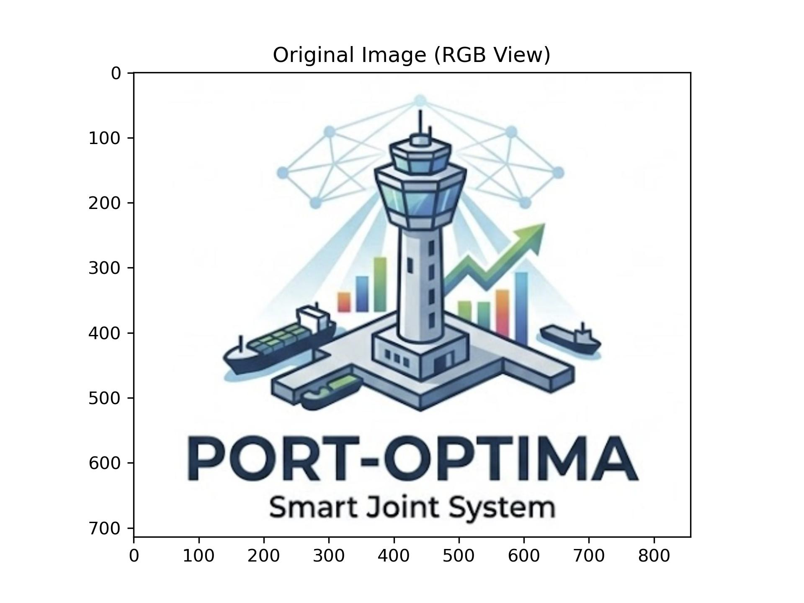
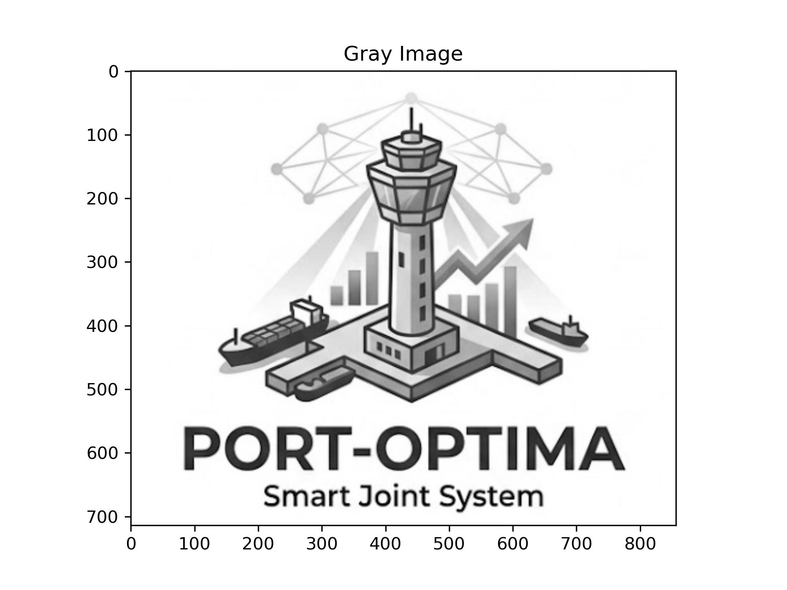
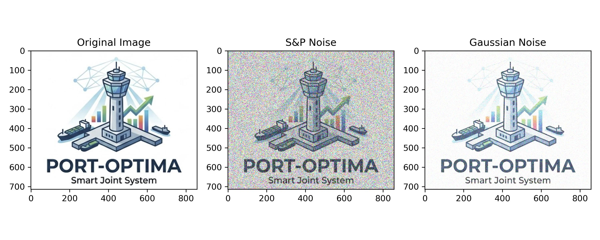
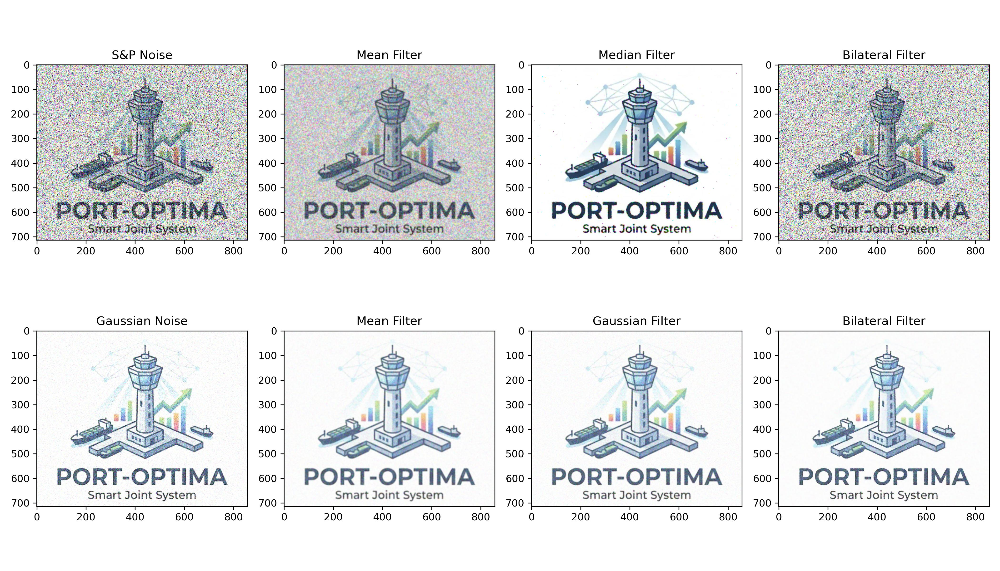
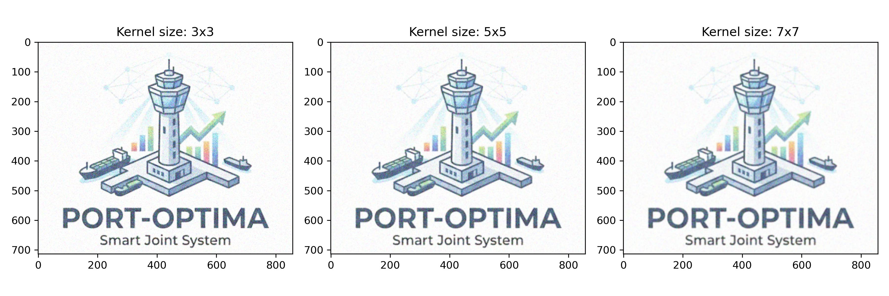
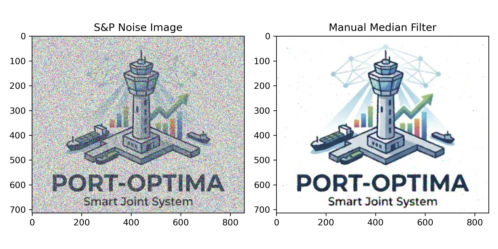

# 计算机视觉实验报告二

**实验名称：** 图像滤波

**姓名：** 薛昕瑶  

**学号：** 202410315005

**实验环境：** Python 3.13 / OpenCV / NumPy / Matplotlib / Scikit-image  

---

## 一、 实验目的与原理概述

### 1.1 实验目的
1. **掌握图像基础读写与像素访问：** 学习使用 OpenCV 读取图像文件，获取并修改特定像素点的颜色通道值。
2. **理解颜色空间转换：** 掌握图像在不同色彩空间（BGR、RGB、Grayscale）之间的转换原理及其在可视化过程中的重要性。
3. **理解噪声生成机制：** 学习并掌握向图像中人为添加椒盐噪声与高斯噪声的方法，模拟真实环境中的图像退化。
4. **深入研究经典图像滤波算法：** 掌握均值滤波、中值滤波、高斯滤波以及双边滤波的原理与实现，对比不同滤波器在不同噪声环境下的去噪效能。
5. **探索卷积核参数对滤波的影响：** 分析不同尺寸的卷积核对高斯滤波平滑和去噪效果的影响。
6. **手动实现非线性滤波算法：** 自己编写Python代码实现彩色图像的中值滤波。

### 1.2 核心算法原理
* **颜色空间转换：** OpenCV 默认 BGR 通道排列顺序，而 Matplotlib 在进行图像可视化时要求RGB 顺序。色彩空间转换矩阵将 $R$、$G$、$B$ 分量进行线性或非线性映射。采用加权平均法（如 $Y = 0.299R + 0.587G + 0.114B$）将三通道压缩为单通道。
* **椒盐噪声：** 随机改变图像中的某些像素点，使其呈现纯白或纯黑状态。
* **高斯噪声：** 噪声的概率密度函数服从正态分布，其幅值随机且连续变化。
* **均值滤波：** 线性滤波的一种，用像素邻域内的平均值代替该像素值，容易导致图像边缘模糊。
* **中值滤波：** 非线性滤波的一种，用邻域像素的统计中值代替当前像素值，对椒盐噪声具有极佳的抑制效果，同时能很好地保护图像边缘。
* **高斯滤波：** 基于高斯正态分布权重的线性平滑滤波，对服从高斯分布的噪声具有很好的平滑效果，权重中心高、边缘低。
* **双边滤波：** 结合了空间邻近度与像素值相似度的非线性滤波算法，在平滑噪声的同时能够高效保留图像的锐利边缘。

---

## 二、 实验步骤与核心代码实现

### 2.1 依赖库导入与环境初始化
在实验开始前，引入必要的第三方图像处理与数学计算库。同时，为了防止图片保存时因目标目录不存在而引发抛错，代码自动检测并创建了 `result` 存储文件夹。

```python
import cv2
from skimage.util import random_noise
import numpy as np
from matplotlib import pyplot as plt
import os

# 自动创建保存结果的文件夹
if not os.path.exists('result'):
    os.makedirs('result')
```

### 2.2 原始图像的读取与像素级访问
使用 `cv2.imread` 读取指定路径下的实验图片 `cv--e2test.jpg`。读取成功后，提取图像中坐标为 `(100, 100)` 的像素，输出其底层的 BGR 分量数值，并通过色彩通道转换后交由 Matplotlib 进行可视化和高清持久化存储。

```python
img = cv2.imread('cv--e2test.jpg')

# 获取像素点 (100, 100) 的 BGR 值
(b, g, r) = img[100, 100]
print('Pixel (100,100) BGR:', b, g, r)

plt.imshow(cv2.cvtColor(img, cv2.COLOR_BGR2RGB))
plt.title('Original Image (RGB View)')
plt.savefig('result/original_bgr.jpg', dpi=300)
plt.show()
```


*图 1-1：通过 OpenCV 读取并转换至 RGB 空间显示的原始图像*

### 2.3 颜色空间转换
将图像从 OpenCV 默认的 BGR 空间分别转换至标准的 RGB 空间以及单通道的灰度空间，为后续的滤波和特征处理打下基础。

```python
# BGR → RGB
rgb_img = cv2.cvtColor(img, cv2.COLOR_BGR2RGB)
plt.imshow(rgb_img)
plt.title('RGB Image')
plt.savefig('result/rgb_image.jpg', dpi=300)
plt.show()

# BGR → Gray
gray_img = cv2.cvtColor(img, cv2.COLOR_BGR2GRAY)
plt.imshow(gray_img, cmap='gray')
plt.title('Gray Image')
plt.savefig('result/gray_image.jpg', dpi=300)
plt.show()
```

*图 1-2：标准 RGB 空间彩色图像*


*图 1-3：经过加权平均法转换后的单通道灰度图像*

### 2.4 人为添加模拟噪声
为了评估后续滤波器的去噪效能，采用 `scikit-image` 的 `random_noise` 工具包，在原图基础上分别注入污染程度较高的椒盐噪声（`amount=0.4`）与高斯噪声（`mean=0.2, var=0.03`）。

```python
# 椒盐噪声
sp_noise_img = random_noise(rgb_img, mode='s&p', amount=0.4)

# 高斯噪声
gus_noise_img = random_noise(rgb_img, mode='gaussian', mean=0.2, var=0.03)

plt.figure(figsize=(10, 4))
plt.subplot(1, 3, 1)
plt.imshow(rgb_img)
plt.title('Original Image')

plt.subplot(1, 3, 2)
plt.imshow(sp_noise_img)
plt.title('S&P Noise')

plt.subplot(1, 3, 3)
plt.imshow(gus_noise_img)
plt.title('Gaussian Noise')

plt.tight_layout()
plt.savefig('result/noise_comparison.jpg', dpi=300)
plt.show()
```

*图 2-1：原图与分别注入 40% 椒盐噪声、高斯噪声后的退化图像对比*

### 2.5 经典图像滤波方法综合对比
为了系统性评估各项滤波器的性能，将浮点型噪声图像转换回 `uint8` 格式 (`0-255`)，并分别应用均值滤波、中值滤波、高斯滤波以及双边滤波进行处理。

```python
# 转换数据格式以适应OpenCV滤波函数 (uint8, 0-255)
sp_uint8 = (sp_noise_img * 255).astype(np.uint8)
gus_uint8 = (gus_noise_img * 255).astype(np.uint8)

# 1. 均值滤波
mean_sp = cv2.blur(sp_uint8, (5, 5))
mean_gus = cv2.blur(gus_uint8, (5, 5))

# 2. 中值滤波
mid_sp = cv2.medianBlur(sp_uint8, 5)
mid_gus = cv2.medianBlur(gus_uint8, 5)

# 3. 高斯滤波
gauss_sp = cv2.GaussianBlur(sp_uint8, (5, 5), 0)
gauss_gus = cv2.GaussianBlur(gus_uint8, (5, 5), 0)

# 4. 双边滤波
bilat_sp = cv2.bilateralFilter(sp_uint8, 9, 75, 75)
bilat_gus = cv2.bilateralFilter(gus_uint8, 9, 75, 75)
```

绘制多子图对比矩阵，全面观察不同滤波器在不同噪声污染下的表现：

```python
plt.figure(figsize=(14, 8))

# 椒盐噪声组
plt.subplot(2, 4, 1)
plt.imshow(sp_uint8)
plt.title('S&P Noise')

plt.subplot(2, 4, 2)
plt.imshow(mean_sp)
plt.title('Mean Filter')

plt.subplot(2, 4, 3)
plt.imshow(mid_sp)
plt.title('Median Filter')

plt.subplot(2, 4, 4)
plt.imshow(bilat_sp)
plt.title('Bilateral Filter')

# 高斯噪声组
plt.subplot(2, 4, 5)
plt.imshow(gus_uint8)
plt.title('Gaussian Noise')

plt.subplot(2, 4, 6)
plt.imshow(mean_gus)
plt.title('Mean Filter')

plt.subplot(2, 4, 7)
plt.imshow(gauss_gus)
plt.title('Gaussian Filter')

plt.subplot(2, 4, 8)
plt.imshow(bilat_gus)
plt.title('Bilateral Filter')

plt.tight_layout()
plt.savefig('result/advanced_filter_comparison.jpg', dpi=300)
plt.show()
```


*图 3-1：均值滤波、中值滤波、高斯滤波以及双边滤波在椒盐与高斯噪声下的去噪效能对比*

### 2.6 滤波参数探索：卷积核尺寸对高斯滤波的影响
通过设置 $3 \times 3$、$5 \times 5$ 以及 $7 \times 7$ 三种不同尺度的卷积核，研究参数变化对高斯滤波图像模糊程度与去噪深度的边缘效应。

```python
k3_img = cv2.GaussianBlur(gus_uint8, (3, 3), 0)
k5_img = cv2.GaussianBlur(gus_uint8, (5, 5), 0)
k7_img = cv2.GaussianBlur(gus_uint8, (7, 7), 0)

plt.figure(figsize=(12, 4))
plt.subplot(1, 3, 1)
plt.imshow(k3_img)
plt.title('Kernel size: 3x3')

plt.subplot(1, 3, 2)
plt.imshow(k5_img)
plt.title('Kernel size: 5x5')

plt.subplot(1, 3, 3)
plt.imshow(k7_img)
plt.title('Kernel size: 7x7')

plt.tight_layout()
plt.savefig('result/kernel_size_comparison.jpg', dpi=300)
plt.show()
```


*图 3-2：不同尺寸卷积核（3x3, 5x5, 7x7）对高斯滤波平滑与模糊程度的影响*

### 2.7 手动实现彩色图像中值滤波
通过编写多层循环与Padding，实现一个中值滤波器函数。

```python
def manual_median_filter_color(image, kernel_size=5):
    """
    手动实现彩色图像的中值滤波
    image: 输入彩色图像 (H, W, 3)
    kernel_size: 滤波窗口大小
    """
    pad = kernel_size // 2
    filtered_img = np.zeros_like(image)

    for c in range(3):
        channel = image[:, :, c]
        padded = np.pad(channel, pad_width=pad, mode='edge')
        for i in range(channel.shape[0]):
            for j in range(channel.shape[1]):
                region = padded[i:i+kernel_size, j:j+kernel_size]
                filtered_img[i, j, c] = np.median(region)

    return filtered_img

manual_mid = manual_median_filter_color(sp_uint8, kernel_size=5)

plt.figure(figsize=(8, 4))
plt.subplot(1, 2, 1)
plt.imshow(sp_uint8)
plt.title('S&P Noise Image')

plt.subplot(1, 2, 2)
plt.imshow(manual_mid)
plt.title('Manual Median Filter')

plt.tight_layout()
plt.savefig('result/manual_median.jpg', dpi=300)
plt.show()
```


*图 3-3：自研底层逻辑手动实现彩色图像中值滤波与椒盐噪声图像的对比效果*

---

## 三、 实验结果与分析

1. **色彩空间转换分析：** 经实践证明，若直接使用 BGR 顺序在 Matplotlib 中以 `plt.imshow()` 显示，画面会出现明显的蓝色与红色互换（偏色）现象。通过显式调用 `cv2.cvtColor(img, cv2.COLOR_BGR2RGB)` 能够正确恢复色彩。转换后的灰度图去除了色彩维度，大幅降低了计算复杂度。
2. **噪声对图像退化的影响：** 椒盐噪声破坏了图像局部的像素极值，导致画面布满黑白相间的孤立噪点；高斯噪声则整体抬升或扰动了像素的连续分布，使图像呈现粗糙感。
3. **滤波器效能对比评估：**
   * **均值滤波：** 对高斯噪声有一定平滑效果，但无法很好的抑制椒盐噪声，且边缘轮廓模糊严重。
   * **中值滤波：** 对椒盐噪声展现出极强的抑制能力，能够完美剥离孤立的脉冲噪点同时保留边缘不被破坏。
   * **双边滤波：** 综合效果最佳，它在平滑高斯噪声的同时，由于引入了像素值相似性权重，能够很好地保护图像中的高频边缘不发生退化。
4. **卷积核大小影响分析：** 随着卷积核从 $3 \times 3$ 增大至 $7 \times 7$，高斯滤波的去噪能力随之增强，但伴随而来的副作用是图像细节（如轮廓、纹理）遭到更加严重的抹除。因此在实际工程应用中，需根据具体应用场景权衡去噪需求与细节保留。
5. **手动中值滤波验证：** 手动实现的中值滤波输出结果与 OpenCV 内置函数高度一致，证明了非线性统计排序滤波在剔除极端脉冲噪声上的数学有效性。

---

## 四、 实验结论
本次实验系统性地完成了数字图像处理课程中关于**像素级操作、色彩空间转换、噪声建模、线性与非线性滤波、参数选择及底层算法实现**的核心内容。通过理论结合实际编程，不仅加深了对图像退化与增强机制的理解，也提升了运用 Python 与 OpenCV 解决实际图像处理问题的工程实践能力。
